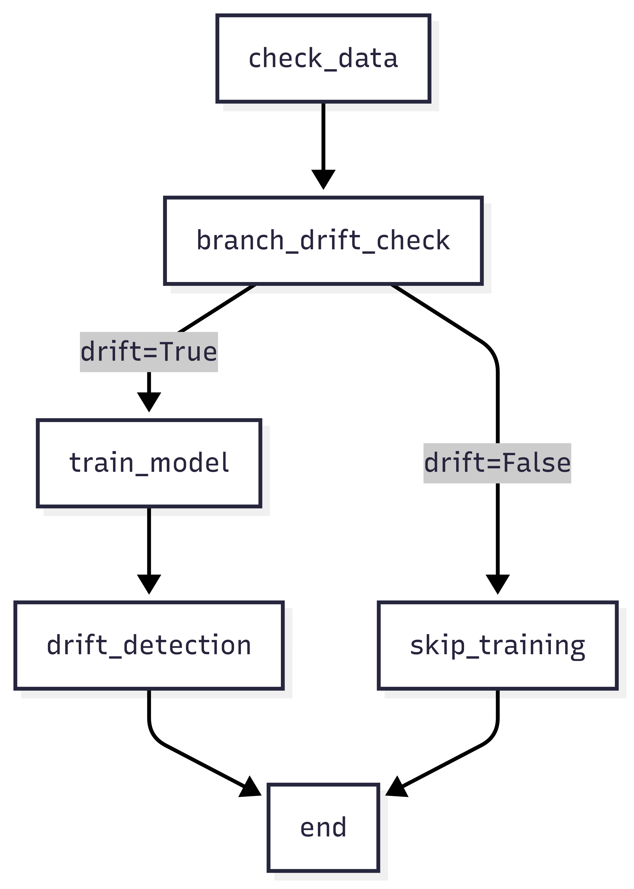
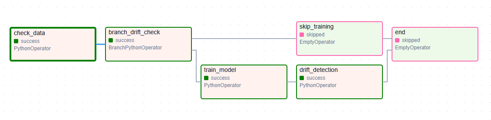

# DAG

Se definió un flujo utilizando **Apache Airflow**, **MLflow**, y un **Decision Tree Classifier**. El pipeline permite:

- Validar de archivos de entrada
- Verificar de *data drift*
- Entrenar condicionalmente el modelo
- Registrar métricas y versiones del modelo

---

## Vídeo Ejecución

https://drive.google.com/file/d/1wOFsBffIQlKMO0K7RB22nPQaDZ545M0M/view?usp=sharing

## 🔧 Estructura General del DAG

El `DAG` principal contiene las siguientes tareas:

| Tarea                   | Descripción |
|------------------------|-------------|
| `check_data`           | Verifica que existan los archivos `transacciones.parquet`, `clientes.parquet` y `productos.parquet`. |
| `branch_drift_check`   | Lógica condicional para decidir si se reentrena el modelo, usando `detect_drift()`. |
| `train_model`          | Ejecuta el script `train_decision_tree.py` si hay *drift*. |
| `drift_detection`      | Registra en logs que se realizó una verificación de *drift*. |
| `skip_training`        | Rama alternativa si no hay *drift*. |
| `end`                  | Finalización. |

---

## Diagrama de Flujo del Pipeline

<p align="center">
  
</p>

---

## 🖥️ Visualización en Airflow UI

Una vez desplegado en el entorno de Airflow, el DAG se ve así:

<p align="center">
  
</p>

---

## Entrenamiento del Modelo

El entrenamiento se realiza con el script `train_decision_tree.py` (carpeta *scripts*), el cual:

1. Carga y prepara las combinaciones cliente-producto-semana.
2. Crea el objetivo binario (`target=1` si hubo compra, `0` si no).
3. Aplica transformación de fechas, imputación, escalado y one-hot encoding.
4. Entrena un `DecisionTreeClassifier`.
5. Usa `MLflow` para registrar:
   - Métricas
   - Parámetros del modelo
   - `joblib`

---

## Detección de Drift

La función `detect_drift()` compara la media de la variable `items` entre los nuevos datos (`transacciones.parquet`) y las estadísticas previas (`train_feature_stats.joblib`). Se estima conveniente utilizar más estadísticos para realizar la comparación, pero por el momento se utiliza un *scheduler* diario para evitar drift.

- Si no existen estadísticas previas para comparar se fuerza reentrenamiento.
- Si el delta entre medias es mayor a `0.1` ➜ se considera *drift significativo*.

Esto permite mantener el modelo actualizado frente a cambios en el comportamiento de compra.

---

## Lógica de Integración Continua

El diseño del DAG permite que el modelo se actualice automáticamente si:

- Se agregan nuevos datos (el DAG corre diario).
- Se detecta *drift* estadístico relevante.
- El pipeline es **modular y extensible**, por lo que puedes reemplazar el modelo o lógica de drift fácilmente.

---

## Estructura (fundamental) del Proyecto

```
.
├── dags/
│   └── decision_tree_dag.py
├── scripts/
│   ├── train_decision_tree.py
│   └── detect_drift.py
├── models/
│   └── decision_tree_model.joblib
├── data/
│   ├── transacciones.parquet
│   ├── clientes.parquet
│   └── productos.parquet
```